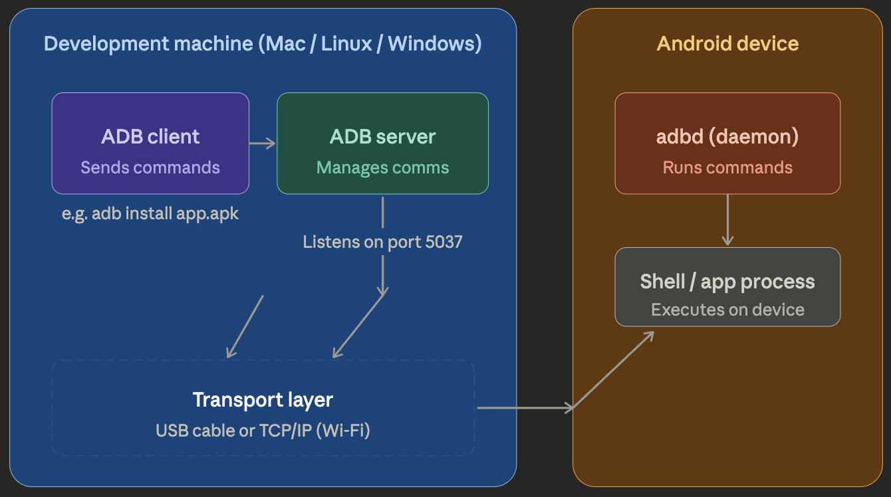
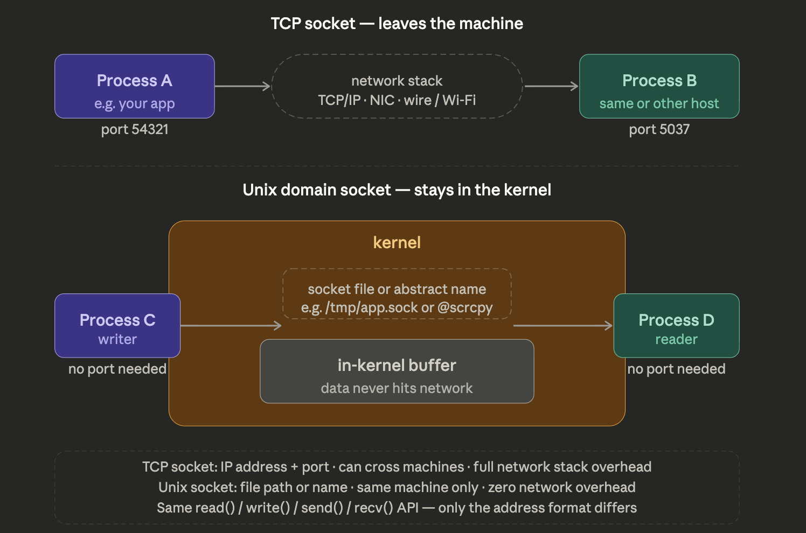
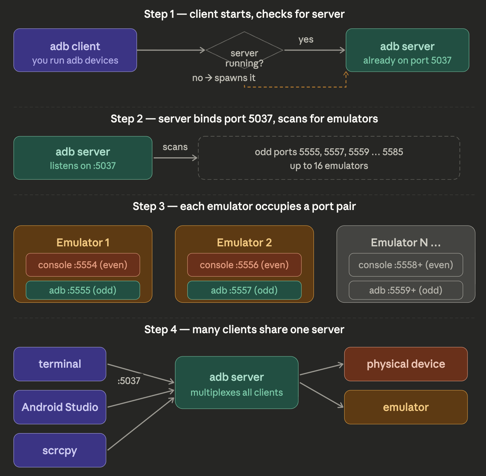
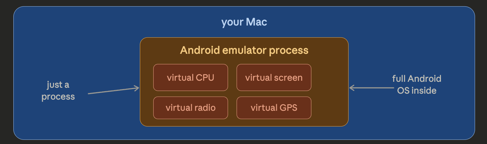
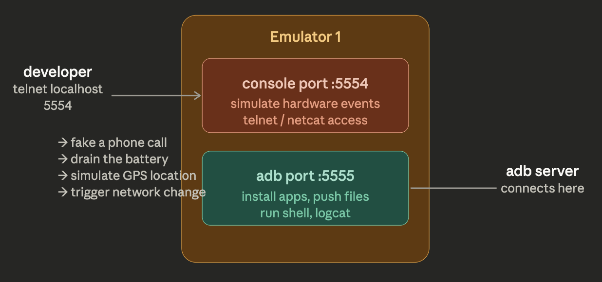
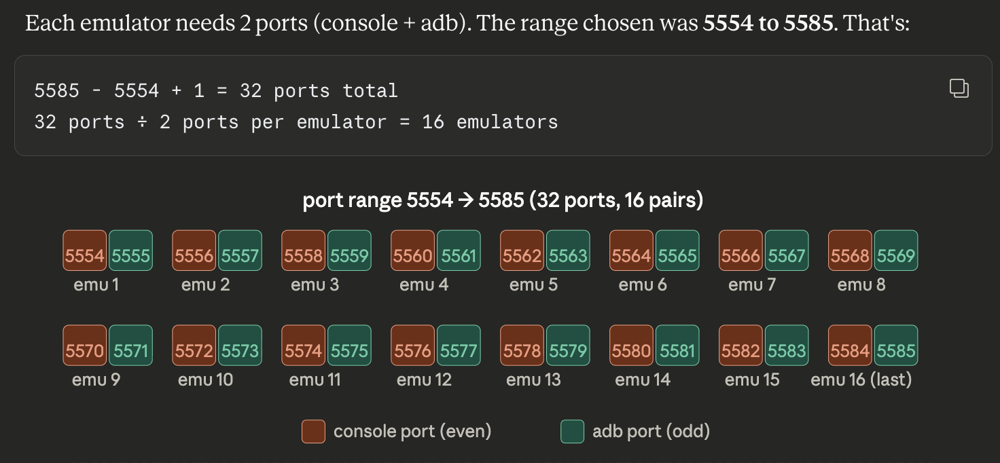
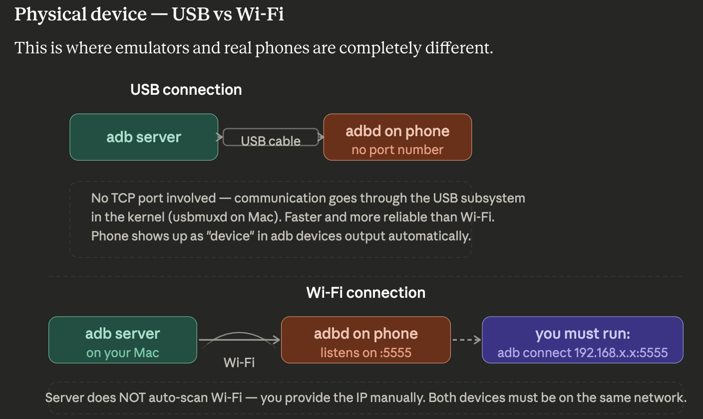

# Android Debugging Bridge(ADB)

Android Debugging Bridge(ADB) is a versatile,cross platform command-line tool that lets you communicate with a device(android).

# How it works
1. You type an adb command → the client starts (or reuses) the server on your machine (port 5037)
2. Server discovers devices over USB or TCP/IP and keeps a persistent connection to adbd on each one
3. Server relays your command to adbd → adbd executes it on the device and streams output back

`The three-component split is the key insight here. The client is stateless — it fires a command and exits. The server is the persistent brain on your Mac, always running in the background, maintaining connections to every device it knows about. The daemon (adbd) is always running on the Android device, waiting for instructions.`

# Difference between tcp connection and UNIX socket connection

# Working of ADB

1. Server at port 5037 always exists.(self-heal mechanism)(client always ping port 5037 for surety)
2. This server act as a front door for all the clients.(android studio,terminal,etc)(single source of truth)
3. The **devices/daemons** `(physical/emulator/etc)` recieves the command through the server and execute and return the output ,if any. This involves **multiplexing** of the server that bridges between multiple clients as well as multiple devices.

# Emulator

`public door (adb port)(SoftWare Part)` and `maintenance panel (console port)(HardWare Part)`
- The console port (even number, e.g. 5554) is a raw telnet interface. You connect to it with telnet localhost 5554 and type commands that simulate real-world hardware events.
- The adb port (odd number, e.g. 5555) is where adbd runs inside the emulator — exactly like on a real phone.

- 16 emulator are automatically scaned by adb, while we can add more emulator or run on any port but will not be scanned automatically and a manual connect will be required. 
- larger number of emulator, hence more RAM and resources are required.

