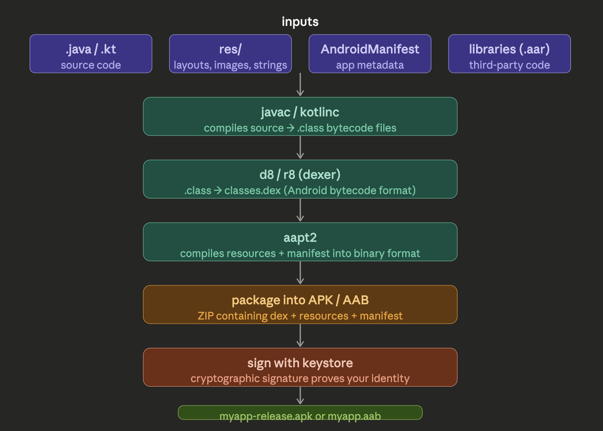
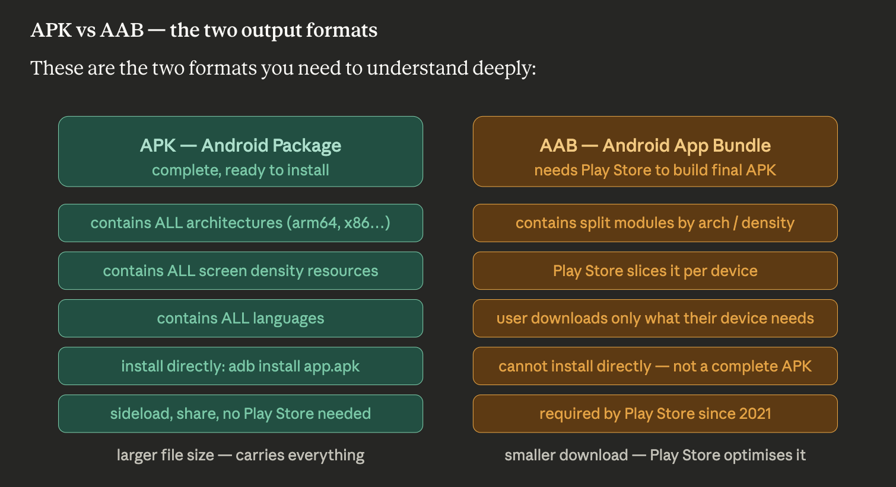
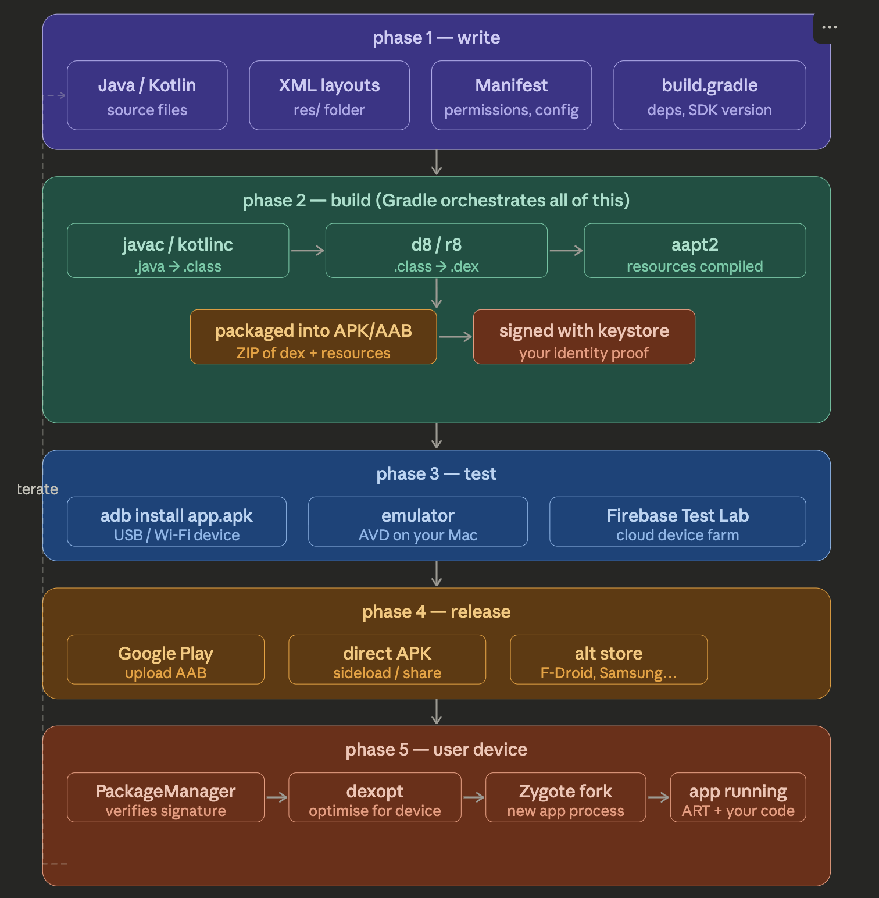

Let me build this up layer by layer before bringing it all together in a final diagram.

## What Android actually is under the hoodAndroid is Linux at the bottom. Everything above it — ART, the framework, your app — sits on top of that Linux foundation. This matters because the kernel is compiled specifically for each phone's ARM chip, but your app bytecode floats above all of that, CPU-neutral.

## Phase 1 — Development

What you write and what tools you use on your machine.

### The languages

```
Java  →  original Android language, verbose but stable
Kotlin →  modern replacement, concise, 100% interoperable with Java
          Google's preferred language since 2017
C/C++ →  via NDK, for performance-critical code (game engines, audio)
          used alongside Java/Kotlin via JNI bridge
```

### OS dependency during development

This is where most developers don't realise there is a dependency:The development tools are identical across all three OSes. The only exception is if you use C/C++ via the NDK — then the compiler (`clang`) is platform-specific but Android Studio manages that automatically.

## Phase 2 — Build

This is where your source code gets transformed into something a phone can run. Gradle orchestrates the whole pipeline.



### APK vs AAB — the two output formats

These are the two formats you need to understand deeply:### OS dependency during the build phase

The build tools themselves have specific OS requirements that matter:

```
Gradle       → needs JDK. JDK runs on Mac/Windows/Linux equally
Android SDK  → works on Mac/Windows/Linux equally
NDK (C/C++)  → clang cross-compiler bundled per OS
               Mac gets macOS clang, Windows gets Windows clang
               but output binary always targets Android ARM

keystore     → your signing key. Lives as a .jks file
               OS doesn't matter — same file works everywhere

CI/CD        → GitHub Actions / Bitrise / CircleCI
               usually runs Linux under the hood
               works fine because Gradle is OS-agnostic
```

The critical point: **the build output is always the same APK/AAB regardless of your dev OS**. A Mac-built APK and a Linux-built APK are identical if compiled from the same source with the same keystore.



## Phase 3 — Release

How your built APK/AAB gets to users.## Phase 4 — End user perspective

What actually happens on the phone when a user installs and runs your app:

```
user taps Install
        ↓
PackageManager verifies the APK signature
        ↓
dex files extracted to  /data/app/com.yourapp/
        ↓
ART runs dexopt — optimises bytecode for this specific device's CPU
        ↓
app icon appears on home screen
        ↓
user taps icon
        ↓
Zygote process forks a new process for your app
        ↓
ART loads your dex, calls Application.onCreate()
        ↓
your app is running
```

`Zygote` is Android's process factory — it is a pre-warmed Java process that forks a copy of itself for every new app launch. This is why Android apps start faster than if they had to boot a fresh JVM every time.

## All the ways to install an APK

```bash
# 1. adb install  — developer classic
adb install myapp.apk

# 2. adb install with reinstall flag (keeps user data)
adb install -r myapp.apk

# 3. push then install (useful for large APKs)
adb push myapp.apk /sdcard/
adb shell pm install /sdcard/myapp.apk

# 4. install to specific device (multiple connected)
adb -s R5CT103WXYZ install myapp.apk

# 5. sideload via file manager on phone
#    download APK in Chrome → tap it → allow unknown sources → install

# 6. Play Store (the normal user path)
#    you upload AAB → Play builds optimised APK → user taps Install

# 7. bundletool (for testing AAB locally without Play Store)
bundletool build-apks --bundle=myapp.aab --output=myapp.apks
bundletool install-apks --apks=myapp.apks
```

## The full developer flow — everything in one pictureThe left side feedback arrow is the reality of day-to-day development — you loop between write, build, and test dozens of times before you ever reach release. The full pipeline from source code to a user running your app involves seven distinct transformations: ```source → bytecode → dex → APK → signed APK → installed → optimised running process```. Each step exists for a specific reason, and understanding all of them is what separates a developer who just follows tutorials from one who can debug anything that goes wrong in the pipeline.

